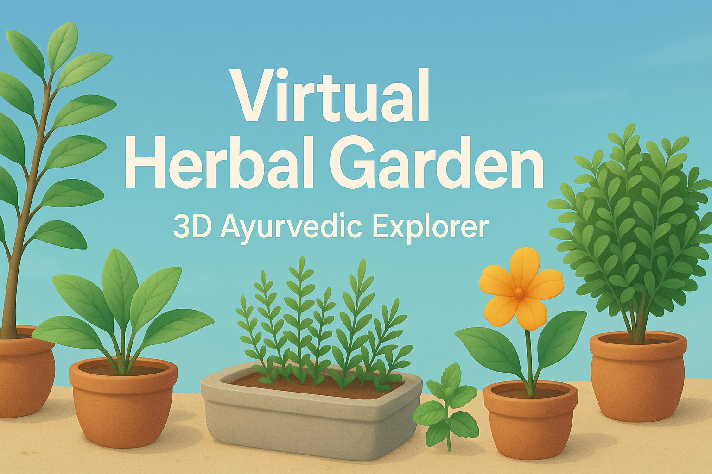

# 🌿 Plant Vision – Virtual Herbal Garden (3D Ayurvedic Explorer)

<p align="center">
  
</p>

**Plant Vision** is an immersive 3D web experience that allows users to explore AYUSH-recognized medicinal plants in a virtual herbal garden. Built using **React.js**, **Three.js**, and **React Three Fiber**, this app offers educational interactivity and a serene, gamified learning experience about the power of Ayurveda.

---

## 🔮 Features

- 🌱 **Interactive 3D Herbal Garden**  
  Explore a fully rendered 3D garden using WebGL and React Three Fiber.

- 🧠 **Ayurveda Quiz Mode**  
  Test your knowledge about medicinal plants with a built-in quiz system.

- 🎓 **Educational Insights**  
  Click on each plant to view detailed information including its Ayurvedic uses and benefits.

- 💻 **Responsive User Interface**  
  Built with React for smooth and intuitive navigation across devices.

- 🌐 **Optimized 3D Performance**  
  Balanced performance and detail using optimized models and lazy loading.

---

## 🛠 Tech Stack

| Layer        | Technologies                                  |
|--------------|-----------------------------------------------|
| Frontend     | React.js                                      |
| 3D Engine    | Three.js, @react-three/fiber, @react-three/drei |
| Quiz Logic   | JavaScript / React State                      |
| UI Styling   | CSS (Responsive, Inbuilt)                     |
| Hosting      | Firebase / GitHub Pages (Optional)            |

---

## 🚀 Getting Started

### 1. Clone the Repository

```bash
git clone https://github.com/aryansanganti/plant-vision.git
cd plant-vision
2. Install Dependencies
bash
Copy
Edit
npm install
3. Run the App Locally
bash
Copy
Edit
npm run dev
```
Visit http://localhost:5173 to start exploring your virtual herbal garden.

📂 Folder Structure
``` bash
plant-vision/
├── public/
│   ├── models/              # 3D models (GLB/FBX)
│   └── plant-vision-banner.png
├── src/
│   ├── components/          # Reusable components (Garden, Quiz, etc.)
│   ├── data/                # Plant metadata (name, uses, etc.)
│   ├── pages/               # Landing, Quiz, Info
│   ├── App.jsx
│   └── main.jsx
├── .env                     # Optional Firebase or Config Keys
├── vite.config.js
└── README.md
```
🎮 Controls & Experience
Orbit Controls: Rotate, zoom and pan through the garden

Hover/Click: Interact with plants for details

Start Quiz: Learn & test your Ayurveda knowledge

🖼️ Screenshots
Replace these with actual screenshots once deployed.

3D Garden View	Quiz Feature

✅ Use Cases
🌿 Ayurvedic learning and awareness

🧪 College projects related to natural medicine & 3D UI

🎓 Educational gamification in health science

📈 Roadmap
 Add voice narration for plant descriptions

🤝 Contributing
Got ideas or bugs? Contributions are welcome.

``` bash

# Fork it
# Create a feature branch
# Commit and push
# Open a Pull Request
```
📄 License
This project is licensed under the MIT License.
See the LICENSE file for more information.

👤 Author
Aryan Sanganti
